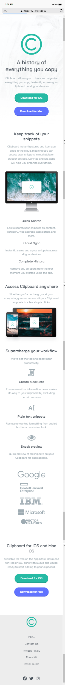

# WEB3BRIDGE - Frontend Mentor | Clipboard landing page

This is a solution to the Clipboard landing page task for WEB2CVII TEAM 1

## Overview

This challenge was gotten from Frontend Mentor and facilitated by WEB3BRIDGE.

**To do this challenge, you need a basic understanding of HTML and Advance CSS.**

### The challenge

Users should be able to:

- View the optimal layout depending on their device's screen size

### Screenshots

### Links

- Solution URL: (https://github.com/Daslaw/clipboard.git)
- Live Site URL:(https://daslaw.github.io/clipboard/)

## My process

- Write and Format the HTML section of the Project
- Styling with Advance CSS
- Pushed and hosted on GITHUB 

### Built with

- Semantic HTML5 markup
- CSS pseudo-class
- Flexbox
- Media-query

### Tools

- VScode
- Chrome Browser

### What I learned

- CSS styling with Flexbox and Media Query
- Use of CSS global Variables
- Advance CSS

## Acknowledgments

Thank you WEB3BRIDGE for this opportunity.